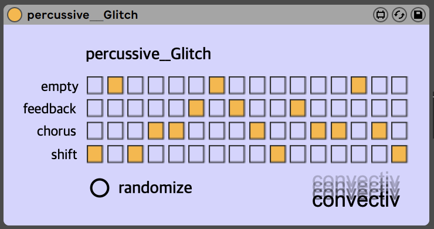

# percussive__Glitch

Max for Live device which utilizes a 16 step sequencer to trigger effects on audio being passed through.

Useful for generating minimal percussion sequences.

Recommended to use a pad or sustained sound source.

## Features

- Random button to generate a new random step sequence
- 3 different effects:
  - shift
    - frequency shifter automated by LFO
  - feedback
    - chorus with extreme feedbaack
  - chorus

## Future Additions

- Increase step sequencer length
- More effects
- Controllable effect parameters
- Randomize effect parameters